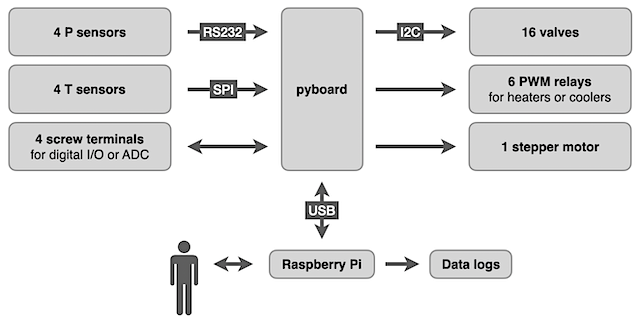

# Python Prep Line (PyPL)

An open source, open hardware, automated preparation line for geochemical samples. Originally designed for processing CO2 samples, but should handle anything which requires:

* switching relays, valves or heating elements
* monitoring temperature sensors (e.g., PT1000 sensors; type-K thermocouples)
* monitoring MKS vacuum/pressure gauges.
* controlling stepper motors

The user interface runs on a raspberry pi computer. Lower-level ineraction with sensors and various electronic components is handled by a microcontroler (a [pyboard](https://docs.micropython.org/en/latest/pyboard/quickref.html) running [micropython](https://docs.micropython.org/en/latest/index.html)):

## 1 – Hardware
### 1.1 – Motherboard
### 1.2 – Pyboard
### 1.3 – Stepper Motor Controller Board
### 1.4 – Temperature Readings

Up to 4 independent temperature reading. Each reading may come from either:

* a thermocouple connected to a MAX31856 chip
* a resistance temperature detector (PT1000 or PT100) connected to a MAX31865 chip

#### 1.4.1 – Thermocouple Board

* [Adafruit 3263](https://www.adafruit.com/product/3263)
* Based on MAX31856

#### 1.4.2 – PT1000 Board

* [Adafruit 3328](https://www.adafruit.com/product/3328)
* Based on MAX31865

#### 1.4.3 – Thermocouples (type K)

* Supplier: https://www.prosensor.fr
* Part #: K4051000-2-1/TEF
* OD = 0.5 mm
* L = 1 m

#### 1.4.4 – Resistance Temperature Detectors  (PT1000)

### 1.5 – Heating Elements
* Supplier: https://www.prosensor.fr
* Part #: CCHC-1/4-11/4-300-0 or CCHC-6.5-30-300-0
* 300 W at 230 VAC
* OD = 6.35 mm or 6.5 mm
* L = 31.75 mm or 30 mm

### 1.6 – Pressure Readings

#### 1.6.1 – MicroPirani and DualTrans Vacuum/Pressure Gauges

* Part #: [MKS 925](https://www.mksinst.com/f/925-micro-pirani-vacuum-transducer)
* Part #: [MKS 910](https://www.mksinst.com/f/910-micro-pirani-vacuum-transducer)
* Communicates through an RS232 serial connection

#### 1.6.2 – RS232 / TTL Transceiver Board

Converts TTL (Transistor-Transistor Logic) signals to and from RS232 signals

* [SparkFun Transceiver Breakout (BOB-11189)](https://www.sparkfun.com/products/11189)
* Based on MAX3232

### 1.7 – Relays

The pyboard communicates through I2C with a GPIO expansion board based on the MCP23017 chip, providing access to 16 input or output ports. Each of these ports is connected to a power MOSFET, providing the ability to quickly switch DC power to 16 screw terminals.

#### 1.7.1 – GPIO Expansion Board

* Based on MCP23017
* All ports are pulled low (connected to ground by 10K resistors).
* As a result, all switches are off by default.

#### 1.7.2 – Power MOSFETSs

Used to connect screw terminals to ground safely and quickly. This means that when the MOSFET is off, whatever is connected to the screw terminals will float at a moderately high DC voltage (e.g., 24 VDC) despite being powered off, so any electrical connections should be suitably insulated.

### 1.8 – Power Supply
### 1.9 – Aluminum Frame
### 1.10 – Acid Reaction System
#### 1.10.1 – Common Acid Bath
#### 1.10.2 – Sample Carousel
### 1.11 – Pumping System
## 2 – Software
### 2.1 – Pyboard Code
### 2.2 – GUI Code