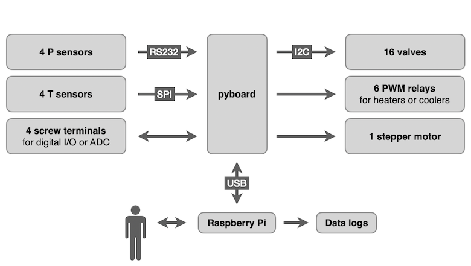

# Python Prep Line (PyPL)

An open source, open hardware, automated preparation line for geochemical samples. Originally designed for processing CO2 samples, but should handle anything which requires:

* switching relays, valves or heating elements
* monitoring temperature sensors (e.g., [thermocouples](https://en.wikipedia.org/wiki/Thermocouple), [PT1000](https://en.wikipedia.org/wiki/Resistance_thermometer) sensors)
* monitoring MKS vacuum/pressure gauges.
* controlling [stepper motors](https://en.wikipedia.org/wiki/Stepper_motor)

The user interface runs on a raspberry pi computer but this computer may be switched off or unplugged without affecting automated processes, which remain running on an independent microcontroller which handles lower-level interaction with sensors and various electronic components:

## 1 – Hardware
### 1.1 – Motherboard

A custom PCB connects the [pyboard](https://store.micropython.org/product/PYBv1.1) microcontroller running [micropython](https://docs.micropython.org/en/latest/index.html) to the other electronic components, with the following inputs/outputs:

* one fuse-protected 24 VDC input
* one USB input/output
* four general-purpose inputs/outputs (GPIO) which may be connected to external peripherals
* four [D-SUB](https://en.wikipedia.org/wiki/D-subminiature) connectors for [RS-232](https://en.wikipedia.org/wiki/RS-232) connections
* four screw terminal groups for temperature sensors
* twenty-two screw terminal groups for 24 VDC relays, of which six can be configured for pulse-width modulation (PWM), thus usable for PID control
* one bipolar stepper motor driver

### 1.2 – Pyboard

The brains of the operation is a pyboard (v.1.1, documentation [here](https://docs.micropython.org/en/latest/pyboard/quickref.html)), based on a 168 MHz Cortex M4 CPU.

Note that the maximum total current out of the 3.3V output pins of the pyboard is 250 mA (see [here](https://forum.micropython.org/viewtopic.php?t=9329) for a more complete discussion).

### 1.3 – Stepper Motor Driver Board

We use a breakout board for the MPS MP6500 microstepping bipolar [stepper motor](https://en.wikipedia.org/wiki/Stepper_motor) driver from Pololu (docs [here](https://www.pololu.com/product/2966)). Rotating the motor is achieved by repeatedly switching the STEP pin between high and low. The motherboard is configured by default for 1/8 step resolution (pins MS1 and MS2 high, i.e. set to +3.3 V), but full steps, half-steps and quarter-steps can be selected using different MS1 and MS2 settings, either by modifying the motherboard or by tinkering with the stepper driver board.

These driver boards work well but are easy to fry when mishandled. Never connect or disconnect motor wires while the driver board is powered.

### 1.4 – Temperature Readings

Up to 4 independent temperature reading. Each reading may come from either:

* a [thermocouple](https://en.wikipedia.org/wiki/Thermocouple) connected to a MAX31856 chip
* a [resistance temperature detector](https://en.wikipedia.org/wiki/Resistance_thermometer) (PT1000 or PT100) connected to a MAX31865 chip

#### 1.4.1 – Thermocouple Board

* [Adafruit 3263](https://www.adafruit.com/product/3263)
* Based on MAX31856
* Configured for continuous readings and no averaging; with these settings the IC automatically measures T every 100 ms or so (82 ms in our tests) with measurement noise on the order of 0.05 °C.
* Reading the latest measurements using SPI is much faster (only about 0.14 ms when tested using a baudrate of 1e7).
* Maximum current used by each MAX31856 is 2 mA.

#### 1.4.2 – PT1000 Board

* [Adafruit 3328](https://www.adafruit.com/product/3328)
* Based on MAX31865

#### 1.4.3 – Thermocouples (type K)

* Supplier: https://www.prosensor.fr
* Part #: K4051000-2-1/TEF
* OD = 0.5 mm
* L = 1 m

#### 1.4.4 – Resistance Temperature Detectors  (PT1000)

### 1.5 – Heating Elements

* Supplier: https://www.prosensor.fr
* Part #: CCHC-1/4-11/4-300-0 or CCHC-6.5-30-300-0
* 300 W at 230 VAC
* OD = 6.35 mm or 6.5 mm
* L = 31.75 mm or 30 mm

These relays are powered by 230 VAC and should thus only be switched using dedicated optocoupler relays (see below). 

### 1.6 – Pressure Readings

#### 1.6.1 – MicroPirani and DualTrans Vacuum/Pressure Gauges

* Part #: [MKS 925](https://www.mksinst.com/f/925-micro-pirani-vacuum-transducer)
* Part #: [MKS 910](https://www.mksinst.com/f/910-micro-pirani-vacuum-transducer)
* Communicates through an [RS-232](https://en.wikipedia.org/wiki/RS-232) serial connection

#### 1.6.2 – RS232 / TTL Transceiver Board

Converts TTL (Transistor-Transistor Logic) signals to and from [RS-232](https://en.wikipedia.org/wiki/RS-232) signals

* [SparkFun Transceiver Breakout (BOB-11189)](https://www.sparkfun.com/products/11189)
* Based on MAX3232

### 1.7 – Relays

The pyboard communicates through I2C with a GPIO expansion board based on the MCP23017 chip, providing access to 16 input or output ports. Each of these ports is connected to a power MOSFET, providing the ability to quickly switch DC power to 16 screw terminals.

#### 1.7.1 – GPIO Expansion Board

* Based on MCP23017
* All ports are pulled low (connected to ground by 10K resistors).
* As a result, all switches are off by default.

#### 1.7.2 – Power MOSFETSs

Used to connect screw terminals to ground safely and quickly. This means that when the MOSFET is off, whatever is connected to the screw terminals will float at a moderately high DC voltage (e.g., 24 VDC) despite being powered off, so any electrical connections should be suitably insulated.

#### 1.7.3 – Optocoupler relays

### 1.8 – Power Supply
### 1.9 – Aluminum Frame
### 1.10 – Acid Reaction System
#### 1.10.1 – Common Acid Bath
#### 1.10.2 – Sample Carousel
### 1.11 – Pumping System
## 2 – Software
### 2.1 – Pyboard Code
### 2.2 – GUI Code